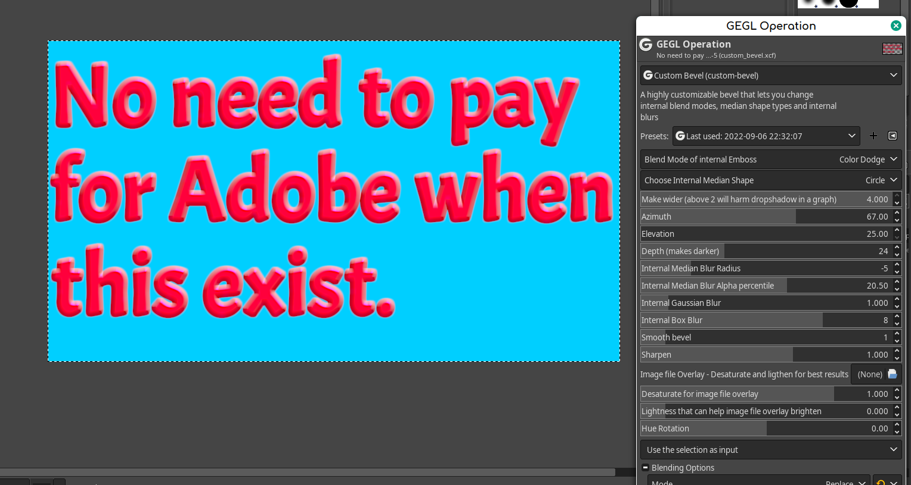

## Custom Bevel - A Gimp Plugin to make any bevel/bump effect that your heart desires.
BECAUSE OF YOUR CARE AND SUPPORT A BRANCH OF CUSTOM BEVEL WAS ACCEPTED IN GIMP 2.99 officially.  It will be named "Chamfer" and will have a different GUI and lack Gimp only blend modes. This plugin build is seperate from the version that will be in Gimp and can co-exist with Gimp's version.





## OS specific location to put GEGL Filter binaries 

Windows
 C:\\Users\<YOUR NAME>\AppData\Local\gegl-0.4\plug-ins
 
 Linux 
 /home/(USERNAME)/.local/share/gegl-0.4/plug-ins
 
 Linux (Flatpak)
 /home/(USERNAME)/.var/app/org.gimp.GIMP/data/gegl-0.4/plug-ins


## Compiling and Installing

### Linux

To compile and install you will need the GEGL header files (`libgegl-dev` on
Debian based distributions or `gegl` on Arch Linux) and meson (`meson` on
most distributions).

```bash
meson setup --buildtype=release build
ninja -C build

```

If you have an older version of gegl you may need to copy to `~/.local/share/gegl-0.3/plug-ins`
instead (on Ubuntu 18.04 for example).


### Windows

The easiest way to compile this project on Windows is by using msys2.  Download
and install it from here: https://www.msys2.org/

Open a msys2 terminal with `C:\msys64\mingw64.exe`.  Run the following to
install required build dependencies:

```bash
pacman --noconfirm -S base-devel mingw-w64-x86_64-toolchain mingw-w64-x86_64-meson mingw-w64-x86_64-gegl
```

Then build the same way you would on Linux:

```bash
meson setup --buildtype=release build
ninja -C build
```

## More image previews to show off how based this plugin is. 


July 2023 update makes new styles possible.


Renders Custom Bevel Generated.


Enjoy Custom Bevel. 
